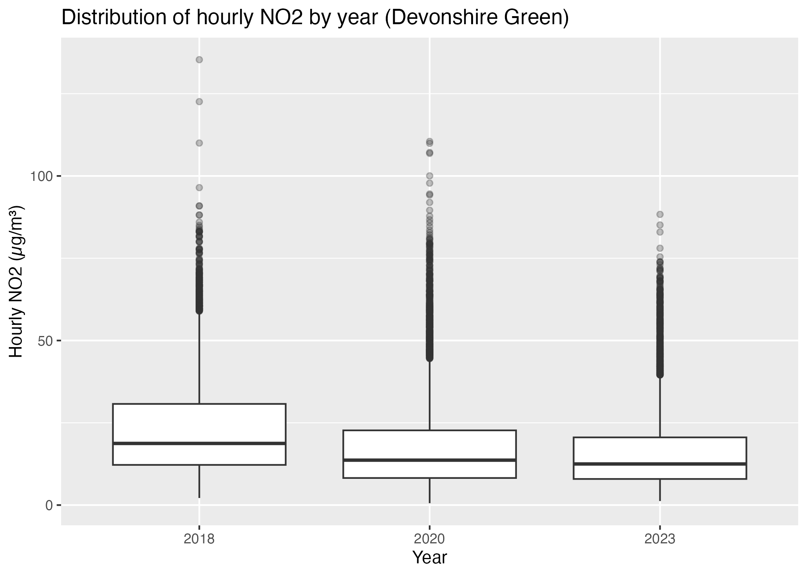
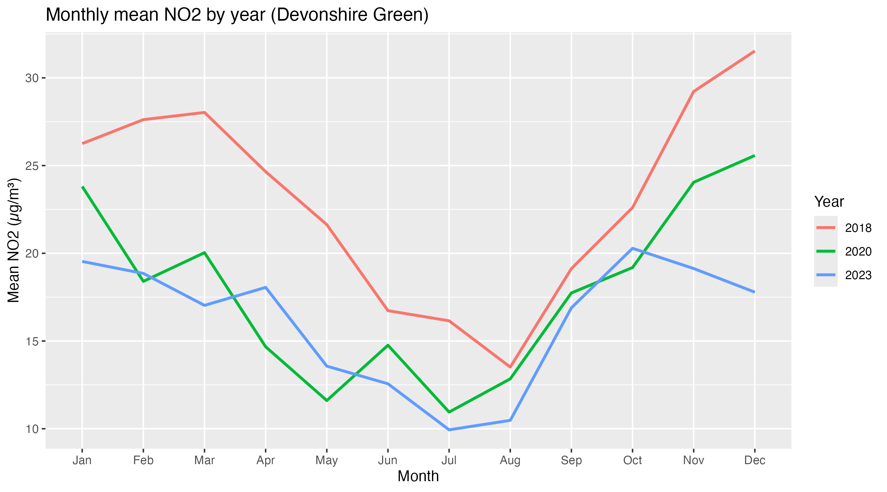
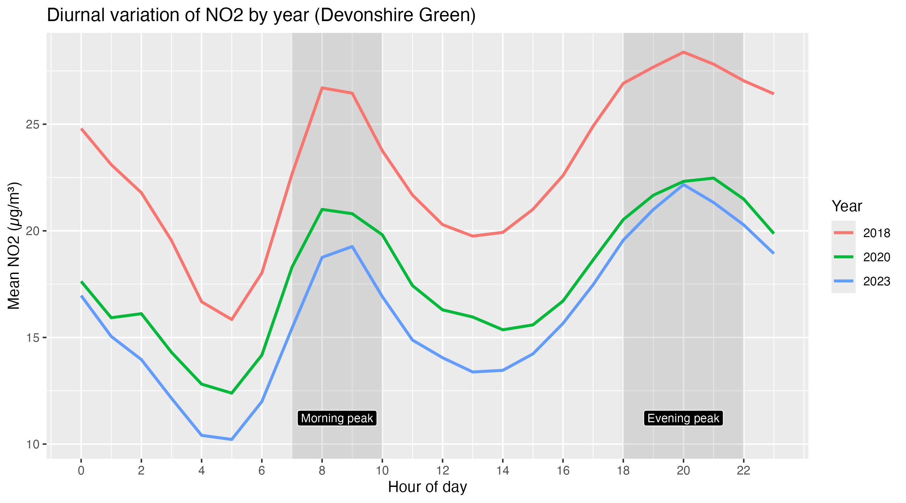

## NO₂ Variation Before, During, and After COVID-19
Devonshire Green Monitoring Station, Sheffield (2018–2023)

This project investigates how hourly nitrogen dioxide (NO₂) concentrations changed across three key periods: pre-COVID (2018), during COVID (2020), and post-COVID (2023).

Using openly available UK-AIR monitoring data, the analysis explores inter-annual differences, seasonal patterns, and diurnal (hourly) variation in urban air pollution.

---

## Research Questions

**RQ1:** How did overall NO₂ concentrations differ between the pre-COVID (2018), COVID (2020), and post-COVID (2023) periods?

**RQ2:** What seasonal and diurnal (hourly) patterns can be identified across the three study periods?

---

## Key Findings

- Annual NO₂ concentrations declined progressively from 2018 to 2023.
- Variability and extreme high-concentration events also decreased over time.
- Seasonal patterns remained consistent: higher concentrations in winter, lower in summer.
- Diurnal structure persisted across all years, with morning and evening peaks.
- Overall pollution intensity changed, but temporal dynamics remained structurally stable.

---
##  Visualisations
### Distribution of NO₂ by Year

### Monthly Mean NO₂

### Diurnal Variation

---
##  Methods Overview

- Data cleaning and preprocessing in R
- Date-time processing using lubridate
- Data manipulation using tidyverse
- Visualisation using ggplot2
- Descriptive statistics (mean, median, SD, 95th percentile)
- Monthly and hourly aggregation for temporal analysis

---
##  How to Run the Code

1️⃣ Clone the repository

git clone https://github.com/yunju-ruby12/no2_covid_sheffield.git

2️⃣ Open in RStudio

Open:

no2_covid_sheffield.Rproj

3️⃣ Run scripts in order

R/01_data_cleaning.R

R/02_analysis.R

Outputs will be generated in:

outputs/figures/

outputs/tables/

---
##  Project Structure

no2_covid_sheffield/
│
├── R/
│   ├── 01_data_cleaning.R
│   └── 02_analysis.R
│
├── data_raw/
├── data_intermediate/
├── data_clean/
├── outputs/
│   ├── figures/
│   └── tables/
│
└── README.md

---
##  Skills Demonstrated

- Environmental data analysis

- Time-series aggregation

- Exploratory data analysis

- Data visualisation

- Reproducible research workflow

- GitHub documentation

---
##  About

This project was developed as part of the IJC437 Data Science coursework.
It demonstrates analytical workflow, interpretation of environmental data, and professional code organisation.

---

## Author
Yun-Ju Chen
MSc Data Science | University of Sheffield
Skills: R, Data Analysis, Data Cleaning, Data Visualisation, Time-Series Exploration
